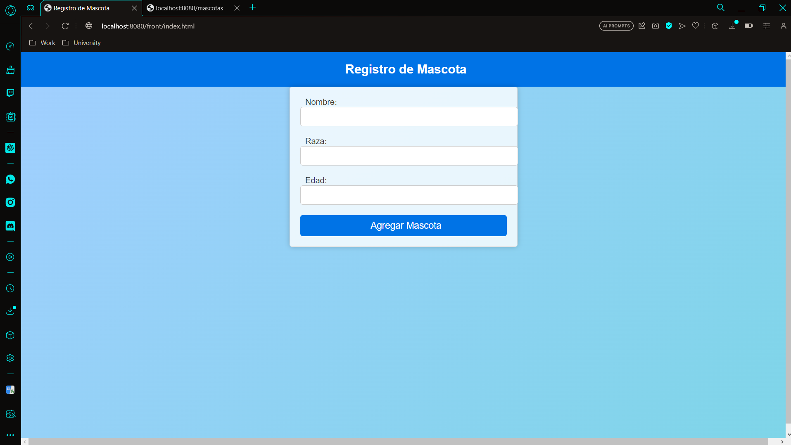
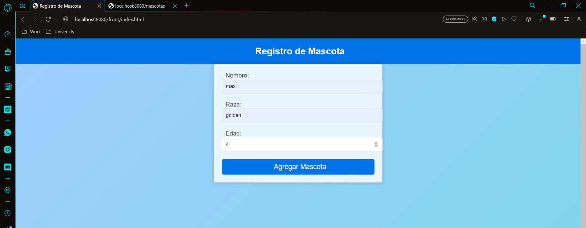
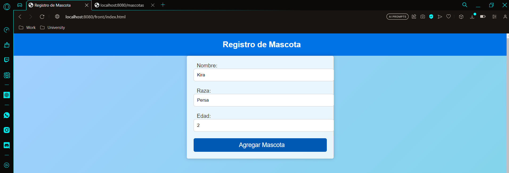
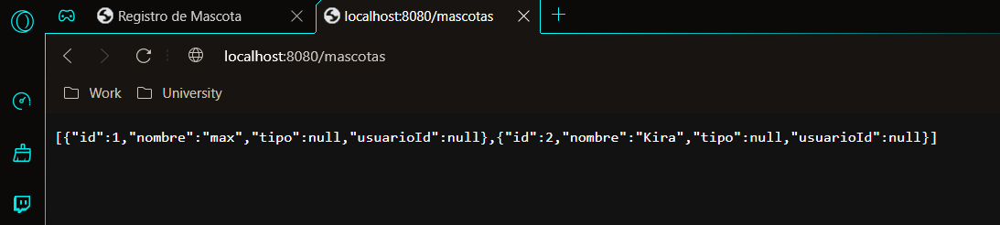

# 🐕‍🦺🦮 Proyecto PawsConnect 🐶🐕

## Introducción
Bienvenidos al mundo de Paws Connect, donde las huellas de nuestras queridas mascotas se cruzan para crear conexiones especiales. A continuación profundizaremos en nuestra visión y estrategia, a través del Modelo Canvas, para conectar a dueños de perros, gatos, criadores y amantes de los animales. Desde segmentos de clientes hasta flujos de ingresos, exploraremos cómo nuestra plataforma satisface necesidades y crea relaciones únicas en el reino de las mascotas y sus dueños para crear un mundo más alegre.

## Objetivo

* Plataforma para conectar a dueños de mascotas con fines de reproducción y socialización de las mismas.
* Búsqueda de parejas de la misma raza y compatibilidad genética.
* Información sobre salud y antecedentes de los mascotas en la plataforma.
* Comunidad de amantes de los mascotas donde pueden interactuar de forma social e informativa.

### Requerimientos:

Tener instalado maven, entorno de desarrollo para el lenguaje (java) repositorio de git (https://github.com/DanielBuilesG/PawsConnect.git)

### Ejecución del programa

* Para ejecutar lo primero es clonar el repositorio (https://github.com/DanielBuilesG/PawsConnect.git).
* Poner en ejecución el servidor web ya sea desde mvn iniciando la clase (Pawsconnect).
* Ingresar desde el navegador de su preferencia.
* En la barra de búsqueda ingresar http://localhost:8080/front/index.html
* Ingrese los datos de su mascota para un registro exitoso (recuerde que pueden ser varias)
* Para visualizar la lista actual de mascotas ingrese a (http://localhost:8080/mascotas)

## Hitos implementados en el proyecto

* servicio con Spring Boot y Java
* Spring Boot REST API
* Spring Boot Data with MongoDB
* Unit Testing

## Funcionamiento

## Autores

- Daniel Builes Gonzales
- David Arturo Narváez Lossa

